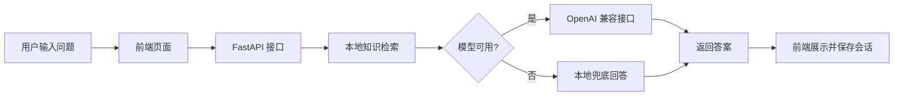

# AlgoGuide Agent

AlgoGuide Agent 是一个面向算法学习场景的 AI 助手原型。它把“提问、检索、生成、保存会话”串成了一条完整链路，适合做成简历项目和面试演示项目。

## 你现在能看到什么

- 一个接近 ChatGPT 风格的网页聊天界面
- 左侧会话列表，右侧对话区域
- 底部固定输入框
- 支持快捷问题填充
- 支持流式输出和普通输出两种聊天方式
- 支持本地会话保存
- 支持本地知识检索和模型回答兜底

## 项目当前状态

这是一个可运行的 MVP 版本，已经完成了主流程：

1. 用户在网页输入问题
2. 后端先做本地知识检索
3. 如果配置了模型 API，就调用外部模型生成回答
4. 如果模型超时或失败，就回退到本地兜底回答
5. 当前会话会被保存到本地 `data/sessions.json`
6. 左侧列表会显示最近会话

## 目录结构

- `app.py`：FastAPI 入口，挂载接口和静态页面
- `agent/chain.py`：对话编排、API 调用、流式返回
- `agent/retriever.py`：轻量检索逻辑
- `agent/sessions.py`：本地会话持久化
- `agent/env.py`：读取本地 `.env`
- `agent/prompt.py`：回答风格约束
- `knowledge/build_index.py`：构建本地索引
- `knowledge/docs/`：知识库文档
- `static/`：前端页面、样式和脚本
- `data/sessions.json`：本地会话数据
- `.vscode/`：VS Code 配置

## 核心功能说明

### 1. 聊天

网页输入问题后，会发送到后端 `/api/chat` 或 `/api/chat/stream`。

### 2. 本地知识检索

当前版本不是 FAISS 向量库，而是一个轻量索引：

- 先把知识文档切块
- 再用关键词重叠找相关片段
- 命中的内容会拼到模型输入里

这个版本的好处是：

- 容易跑起来
- 容易解释
- 方便先把 MVP 做通

### 3. 模型调用

如果你在 `.env` 里配置了 API Key，项目会尝试调用 OpenAI 兼容接口。

如果调用失败，系统会自动回退到本地兜底回答，保证页面仍然可用。

### 4. 会话保存

聊天记录会写入 `data/sessions.json`。

这样做的好处是：

- 刷新页面后还能看到历史会话
- 左侧可以显示最近聊天
- 后面可以继续扩展成真正的长期记忆

## 接口说明

- `GET /api/health`：健康检查
- `GET /api/status`：检查当前模型配置是否可用
- `POST /api/chat`：普通聊天接口
- `POST /api/chat/stream`：流式聊天接口

## 数据流

可以把它理解成下面这个流程：



## 如何运行

### 1. 创建虚拟环境

```powershell
python -m venv .venv
```

### 2. 激活虚拟环境

```powershell
.\.venv\Scripts\Activate.ps1
```

如果 PowerShell 报执行策略限制，可以先运行：

```powershell
Set-ExecutionPolicy -ExecutionPolicy RemoteSigned -Scope CurrentUser
```

### 3. 安装依赖

```bash
pip install -r requirements.txt
```

### 4. 构建本地索引

```bash
python knowledge/build_index.py
```

### 5. 启动服务

```bash
uvicorn app:app --reload
```

### 6. 打开浏览器

```text
http://127.0.0.1:8000
```

## 环境变量

项目根目录支持一个本地 `.env` 文件。

### OpenAI 官方接口示例

```bash
OPENAI_API_KEY=sk-...
OPENAI_MODEL=gpt-4.1-mini
OPENAI_BASE_URL=https://api.openai.com/v1
OPENAI_TIMEOUT_SECONDS=60
```

### GLM 示例

```bash
OPENAI_API_KEY=你的GLM_API_KEY
OPENAI_MODEL=glm-5.1
OPENAI_BASE_URL=https://open.bigmodel.cn/api/paas/v4/
OPENAI_TIMEOUT_SECONDS=60
```

### 说明

- `OPENAI_API_KEY`：外部模型的访问密钥
- `OPENAI_MODEL`：模型名称
- `OPENAI_BASE_URL`：OpenAI 兼容接口地址
- `OPENAI_TIMEOUT_SECONDS`：请求超时时间，网络慢时可以调大

## 为什么要有 `.env.example`

`.env.example` 是给别人看的配置模板，里面只有示例值。

真正的 `.env` 放本地真实配置，不建议提交到 Git。

## 你现在能改进什么

如果你后面想把这个项目继续做强，最值得做的顺序是：

1. 把轻量检索升级成 FAISS 向量检索
2. 优化超时、重试和错误提示
3. 给回答加上来源引用
4. 把会话摘要做出来，提升多轮对话质量
5. 增加更像产品的加载状态和空状态

## 名词解释

- **Agent**：会调用工具的智能助手，不只是聊天
- **RAG**：检索增强生成，先找资料，再让模型回答
- **轻量索引**：当前项目里的简化检索方式，基于文本切块和关键词匹配
- **向量索引**：把文本转成向量后做相似度检索
- **FAISS**：常用的向量检索库
- **API Key**：调用外部模型时使用的密钥
- **Prompt**：给模型的指令，用来控制回答风格和格式
- **多轮对话**：能继续追问并保留上下文

## 常见问题

### 为什么有时会看到兜底回答？

通常是因为模型请求超时、接口失败，或者本地检索没有命中。系统会自动切到兜底回答，保证页面可用。

### 为什么 README 里说有会话保存？

因为项目里已经有 `agent/sessions.py` 和 `data/sessions.json`，聊天记录会保存到本地。

### 这个项目现在是正式版吗？

不是。它是一个能演示主流程的 MVP，后面还可以继续迭代成更完整的 RAG 应用。

## 备注

如果你想把它进一步包装成简历项目，建议在 README 里再加一节“项目亮点”和一张架构图截图。这个版本已经把基础说明打稳了，后面主要是继续加深工程和效果。
