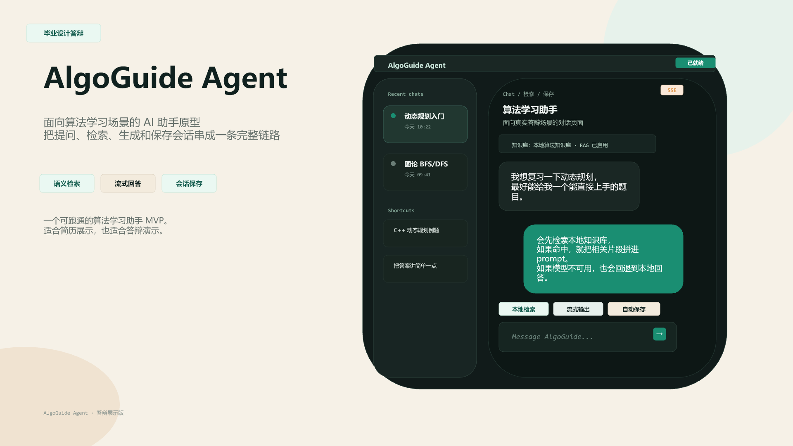
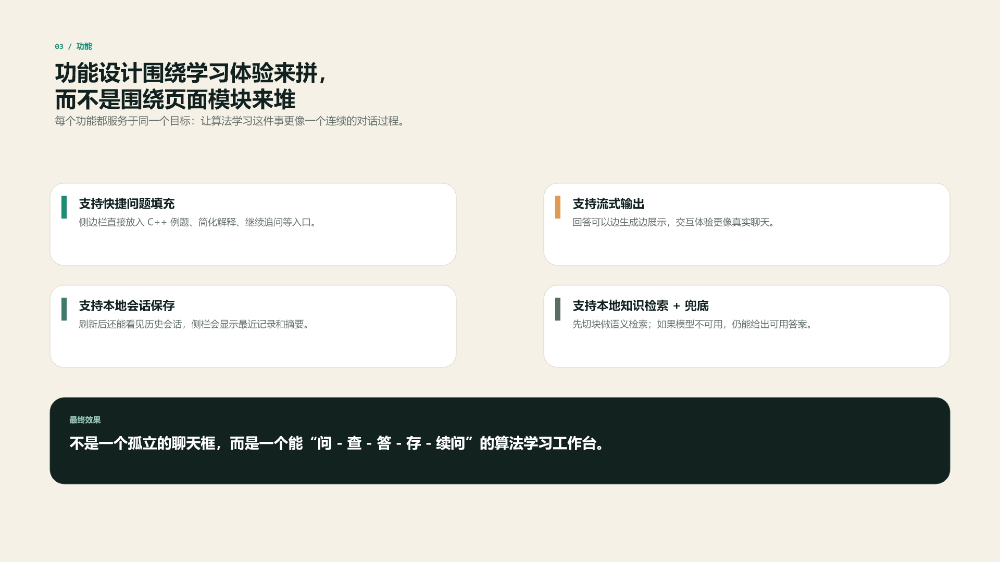
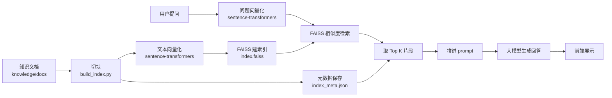
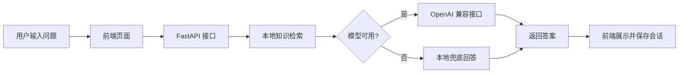

# AlgoGuide Agent

AlgoGuide Agent 是一个面向算法学习场景的 AI 助手原型。它不是单纯的聊天壳，而是把“提问、检索、生成、引用、保存会话”串成了一条完整链路，适合做成简历项目、答辩项目或面试演示项目。

## 一句话定位

一个能围绕算法题进行问答、检索和追问的本地 AI 助手，支持流式输出、会话保存和来源引用。

## 适合谁看

- 想做算法学习助手 Demo 的同学
- 想在面试里讲清楚 RAG / Agent 原型的人
- 想看“前端 + 后端 + 本地知识库”完整链路的人
- 想把一个项目包装成可展示作品的人

## 演示预览

- [查看答辩 PPT](tmp/presentations/algoguide-defense/output/output.pptx)
- 下面两张图来自答辩展示版素材，适合快速了解这个项目的视觉风格和功能布局：





## 项目亮点

- **完整闭环**：从用户提问到知识检索、模型生成、来源引用、会话保存，整条链路都能跑通。
- **检索结果可解释**：每次回答都会带上来源和命中片段，用户能直接看到“答案从哪里来”。
- **语义检索更精准**：使用 `sentence-transformers + FAISS` 做本地知识库语义检索，比纯关键词匹配更懂意思。
- **支持流式输出**：回答可以边生成边展示，交互体验更自然，也更适合演示。
- **具备兜底机制**：模型接口不可用时会自动切换到本地回答，保证项目可用性。
- **会话持久化**：聊天记录支持保存、恢复和摘要，刷新后还能继续看历史对话。
- **工程稳定性更强**：从 JSON 迁移到 SQLite，并保留旧数据自动导入，便于长期维护。
- **适合简历展示**：技术栈清晰、功能完整，能直接讲成一个 RAG / Agent 原型项目。

## 项目当前状态

这是一个可运行的 MVP 版本，已经完成了主流程：

1. 用户在网页输入问题
2. 后端先做本地知识检索
3. 如果配置了模型 API，就调用外部模型生成回答
4. 回答下方会展示来源和命中片段，方便追溯依据
5. 如果模型超时或失败，就回退到本地兜底回答
6. 当前会话会被保存到本地 SQLite 文件 `data/sessions_store.sqlite3`
7. 左侧列表会显示最近会话
8. 长会话会自动生成摘要，后续提问只保留最近几轮上下文，再结合摘要继续回答

## 目录结构

- `app.py`：FastAPI 入口，挂载接口和静态页面
- `agent/chain.py`：对话编排、API 调用、流式返回
- `agent/retriever.py`：语义检索逻辑
- `agent/sessions.py`：本地会话持久化
- `agent/env.py`：读取本地 `.env`
- `agent/prompt.py`：回答风格约束
- `knowledge/build_index.py`：构建本地索引
- `knowledge/embeddings.py`：本地 embedding 模型封装
- `knowledge/docs/`：知识库文档
- `static/`：前端页面、样式和脚本
- `data/sessions_store.sqlite3`：本地会话数据
- `.vscode/`：VS Code 配置

## 核心功能说明

### 1. 聊天

网页输入问题后，会发送到后端 `/api/chat` 或 `/api/chat/stream`。

### 2. 本地知识检索

当前版本使用 `sentence-transformers + FAISS`：

- 先把知识文档切块
- 再用本地 embedding 模型把片段编码成语义向量
- 用 FAISS 做相似度搜索
- 命中的内容会拼到模型输入里

这个版本的好处是：

- 比纯关键词重叠更能理解语义
- 检索效果更适合自然语言问题
- 仍然可以本地构建索引，不需要额外的在线 embedding API
- 结果会以“来源 + 命中片段”的形式展示在回答下方，便于核对依据

#### 向量检索流程



通俗一点说，就是先把知识库文章变成向量，再把用户问题也变成向量，然后让 FAISS 去找最像的那几段内容，最后交给模型生成答案。

### 3. 模型调用

如果你在 `.env` 里配置了 API Key，项目会尝试调用 OpenAI 兼容接口。

如果调用失败，系统会自动回退到本地兜底回答，保证页面仍然可用。

### 4. 会话保存

聊天记录会写入 `data/sessions_store.sqlite3`。

这样做的好处是：

- 刷新页面后还能看到历史会话
- 左侧可以显示最近聊天
- 后面可以继续扩展成真正的长期记忆

### 5. 来源引用

每次回答都会把命中的知识片段整理成引用信息，前端会展示：

- 来源文件名
- 命中片段摘要
- 检索相关度或分数

这能让项目在演示时更像一个“可解释的问答系统”，而不只是一个普通聊天页面。

## 接口说明

- `GET /api/health`：健康检查
- `GET /api/status`：检查当前模型配置是否可用
- `POST /api/chat`：普通聊天接口
- `POST /api/chat/stream`：流式聊天接口

普通聊天和流式接口的返回结果里都会带上：

- `answer`：回答正文
- `sources`：来源文件列表
- `evidence`：命中的片段和摘要
- `used_rag`：是否命中本地知识库
- `session_id`：当前会话 ID
- `session`：最新会话摘要

## 数据流

可以把它理解成下面这个流程：



## 如何运行

如果你只是想先把项目跑起来，按下面顺序执行就行。

### 1. 创建虚拟环境

```powershell
python -m venv .venv
```

### 2. 激活虚拟环境

```powershell
.\.venv\Scripts\Activate.ps1
```

如果 PowerShell 报执行策略限制，可以先运行：

```powershell
Set-ExecutionPolicy -ExecutionPolicy RemoteSigned -Scope CurrentUser
```

### 3. 安装依赖

```bash
pip install -r requirements.txt
```

如果你要启用语义检索，再额外安装：

```bash
pip install -r requirements.semantic.txt
```

### 4. 构建本地索引

```bash
python knowledge/build_index.py
```

它会生成：

- `knowledge/index_meta.json`：片段元数据
- `knowledge/index.faiss`：FAISS 向量索引

第一次运行时，`sentence-transformers` 可能会自动下载 embedding 模型。
如果你的网络环境不方便访问 PyPI，先用基础依赖把项目跑起来，再在有网络或有离线 wheel 的环境里装语义检索依赖。
如果你的环境暂时装不上 FAISS，脚本也会先生成元数据，服务会自动回退到本地线性相似度检索。

### 5. 启动服务

```bash
uvicorn app:app --reload
```

### 6. 打开浏览器

```text
http://127.0.0.1:8000
```

### 启动后你应该看到什么

- 左侧是最近会话
- 右侧是对话区
- 底部是输入框
- 助手回答下方会显示来源和引用片段

## 环境变量

项目根目录支持一个本地 `.env` 文件。

### OpenAI 官方接口示例

```bash
OPENAI_API_KEY=sk-...
OPENAI_MODEL=gpt-4.1-mini
OPENAI_BASE_URL=https://api.openai.com/v1
OPENAI_TIMEOUT_SECONDS=60
```

### GLM 示例

```bash
OPENAI_API_KEY=你的GLM_API_KEY
OPENAI_MODEL=glm-5.1
OPENAI_BASE_URL=https://open.bigmodel.cn/api/paas/v4/
OPENAI_TIMEOUT_SECONDS=60
```

### 说明

- `OPENAI_API_KEY`：外部模型的访问密钥
- `OPENAI_MODEL`：模型名称
- `OPENAI_BASE_URL`：OpenAI 兼容接口地址
- `OPENAI_TIMEOUT_SECONDS`：请求超时时间，网络慢时可以调大
- `EMBEDDING_MODEL_NAME`：本地 embedding 模型名称，默认是 `sentence-transformers/paraphrase-multilingual-MiniLM-L12-v2`

## 为什么要有 `.env.example`

`.env.example` 是给别人看的配置模板，里面只有示例值。

真正的 `.env` 放本地真实配置，不建议提交到 Git。

## 如何讲这个项目

如果你要在面试或答辩里介绍它，可以按这个顺序说：

1. 先讲定位：这是一个面向算法学习场景的 AI 助手，不是普通聊天页。
2. 再讲链路：用户提问后，系统会先检索本地知识库，再生成回答，并把来源和片段展示出来。
3. 最后讲工程点：支持流式输出、会话持久化、兜底回答和长对话摘要，所以它不是一次性的 demo，而是一个可连续使用的工作台。

如果面试官追问亮点，可以补一句：

- “我做的不只是问答，而是把检索、引用、保存和多轮对话做成了完整闭环。”
- “即使模型接口不可用，也能靠本地兜底保持可演示性。”

## 迭代记录

这个项目从最开始到现在，主要遇到过这些问题：

- **本地检索命中不准**：最初只是关键词匹配，遇到同义表达时效果一般，后来升级成 `sentence-transformers + FAISS` 语义检索，命中更稳定。
- **依赖安装受网络影响**：语义检索依赖在国内网络下容易下载失败，后来把基础依赖和语义检索依赖拆分，并提供了镜像安装脚本。
- **会话保存不够稳**：最初用 JSON 文件保存，随着会话变多会越来越重，后来迁移到 SQLite，更适合长期保存和查询。
- **历史数据不能丢**：迁移到 SQLite 时，保留了自动导入旧 `sessions.json` 的逻辑，启动后会自动把历史会话搬过去。
- **首次加载会比较慢**：`sentence-transformers` 首次加载会下载/初始化模型，所以增加了回退逻辑和可选依赖方案，保证项目不至于因为外部网络直接不可用。
- **SQLite 在当前环境里有兼容性问题**：本地磁盘对默认数据库文件不太稳定，所以后来改成更稳的 `data/sessions_store.sqlite3`，并调整了连接参数，确保能正常读写。
- **提交链路也要稳**：前端一旦连续点发送，历史和会话状态容易乱掉，所以后来加了单请求锁；后端保存会话时如果遇到短暂锁冲突，也会先等待再继续，并尽量保住回答结果。
- **长对话也要收得住**：历史消息一多，模型上下文会越来越长，所以后来加了会话摘要，只保留最近几轮原文，旧内容压缩成摘要再继续用。
- **文档和实现要同步**：前面功能和存储方式变动比较多，后来把 README 里的流程图、目录结构和数据说明一起更新，避免文档落后于代码。
- **项目要能直接交付**：在完成主链路后，又补充了简洁的项目总结、技术说明和迭代记录，方便直接用于 GitHub 展示和简历描述。

## 你现在能改进什么

如果你后面想把这个项目继续做强，最值得做的顺序是：

1. 给 FAISS 检索加更大的 embedding 模型，比如 `bge-m3`
2. 优化超时、重试和错误提示
3. 把引用做成可点击的来源定位
4. 把会话摘要做出来，提升多轮对话质量
5. 增加更像产品的加载状态和空状态

## 迭代计划

后续可以按这个顺序继续做：

### 第一阶段：先把体验做稳

- 把模型加载改成启动预热，减少首次卡顿
- 把历史上下文做裁剪，只保留最近几轮
- 优化前端 loading、错误提示、空状态
- 让会话列表更新更顺滑，减少重复请求

### 第二阶段：把 RAG 做强

- 支持文档上传和重新建索引
- 给检索结果加可点击的来源定位和高亮
- 增加会话摘要，解决长对话上下文变长的问题
- 尝试更强的 embedding 模型，比如 `bge-m3`

### 第三阶段：工程化完善

- 加测试
- 加日志和异常监控
- 把配置分层，区分开发、测试、生产
- 补启动脚本和部署说明

### 第四阶段：做成真正的应用

- 加登录和用户隔离
- 每个用户独立保存会话和知识库
- 支持多知识库切换
- 支持更完整的权限管理

## 名词解释

- **Agent**：会调用工具的智能助手，不只是聊天
- **RAG**：检索增强生成，先找资料，再让模型回答
- **Sentence Transformers**：常用的文本 embedding 框架
- **向量索引**：把文本转成向量后做相似度检索
- **FAISS**：常用的向量检索库
- **API Key**：调用外部模型时使用的密钥
- **Prompt**：给模型的指令，用来控制回答风格和格式
- **多轮对话**：能继续追问并保留上下文

## 常见问题

### 为什么有时会看到兜底回答？

通常是因为模型请求超时、接口失败，或者本地检索没有命中。系统会自动切到兜底回答，保证页面可用。

### 为什么 README 里说有会话保存？

因为项目里已经有 `agent/sessions.py` 和本地 SQLite 文件 `data/sessions_store.sqlite3`，聊天记录会保存到本地。

### 这个项目现在是正式版吗？

不是。它是一个能演示主流程的 MVP，后面还可以继续迭代成更完整的 RAG 应用。

## 备注

如果你想把它进一步包装成简历项目，建议在 README 里再加一节“项目亮点”和一张架构图截图。这个版本已经把基础说明打稳了，后面主要是继续加深工程和效果。
