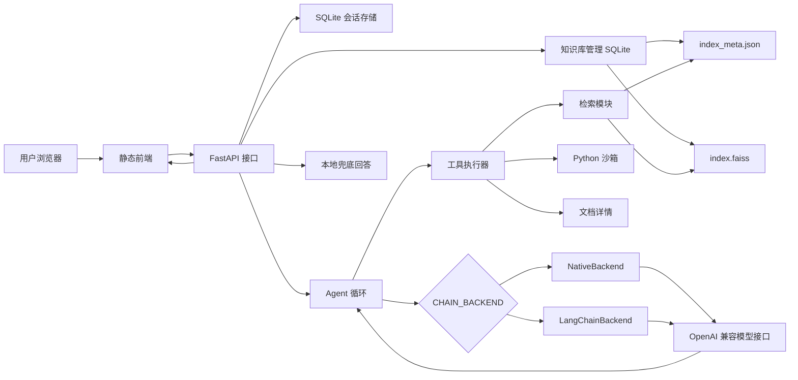

# AlgoGuide Agent

AlgoGuide Agent 是一个面向算法学习场景的本地 AI Agent。项目基于 FastAPI、静态前端、本地知识库、向量检索和 OpenAI 兼容模型接口，提供算法问题问答、知识库检索、来源引用、流式输出和会话持久化能力。

v0.2 新增 **Agent 模式**：LLM 可自主决定何时调用 4 个工具（搜索知识库、执行 Python 代码、对比算法、查看文档详情），支持 ReAct 多步推理循环、流式思考过程和可观测的工具调用链路。前端支持一键切换 Agent/普通模式，生成中可随时停止。

项目目标不是构建一个普通聊天页面，而是提供一条完整的 Agent 问答链路：用户提出问题后，Agent 自主决策是否需要检索知识库、是否需要执行代码验证，再基于结果生成回答，并将思考过程、工具调用和来源证据返回给前端展示。

## 功能特性

- **算法问答**：支持围绕算法概念、题解思路、复杂度分析和代码实现进行提问。
- **Agent 模式**：LLM 自主决定何时调用 `search_knowledge`（搜索知识库）、`run_python`（执行代码）、`compare_algorithms`（对比算法）、`get_document_detail`（查看文档），支持 ReAct 多步推理循环和流式 tool_calls。前端 Agent 开关一键切换，生成中可随时停止。
- **RAG 检索增强**：使用 `sentence-transformers` 生成文本向量，并通过 `FAISS` 进行本地相似度检索。
- **来源引用**：回答结果包含命中的文档来源、片段摘要、位置和相关度信息。
- **流式输出**：支持 `/api/chat/stream` 和 `/api/chat/agent` 以 Server-Sent Events 形式返回增量回答。Agent 模式额外输出 `think`、`tool_call`、`tool_result` 事件。
- **会话持久化**：聊天记录保存到 SQLite，支持最近会话、会话详情、重命名和删除。
- **长对话摘要**：长会话会生成摘要，并结合最近消息继续参与后续问答。
- **知识库管理**：支持知识库列表、文档详情、文档更新、删除和重新构建索引。知识库元数据已从 JSON 迁移到 SQLite。
- **文档导入**：支持 `PDF`、`DOCX`、`PPTX`、`Markdown`、`TXT` 和 `LaTeX` 文件上传。
- **OCR 兜底**：低质量 PDF 会尝试 OCR 解析，并返回可读的错误提示。
- **本地兜底回答**：模型接口不可用或请求失败时，系统会返回本地兜底结果，保证基础可用性。
- **双生成后端**：可通过 `CHAIN_BACKEND` 在原生请求与 LangChain LCEL 生成链之间切换。
- **系统诊断**：`GET /api/diagnostics` 一键检查 API 配置、检索状态、知识库统计、OCR 可用性。

## 技术栈

- 后端：`FastAPI`、`Pydantic`、`Uvicorn`
- 生成编排：原生 `urllib` 或 `LangChain LCEL`
- Agent 框架：自研 ReAct Agent 循环（`agent/agent_loop.py`）
- 工具系统：`search_knowledge` / `run_python` / `compare_algorithms` / `get_document_detail`
- 前端：原生 `HTML`、`CSS`、`JavaScript`（模块化拆分到 `static/js/`）
- 存储：`SQLite`（会话 + 知识库元数据）
- 检索：`sentence-transformers`、`FAISS`
- 文档解析：`pypdf`、`PyMuPDF`、`python-docx`、`python-pptx`
- OCR：`pytesseract`、`Pillow`
- 测试：`unittest`、`pytest`、`FastAPI TestClient`

## 系统架构


```mermaid
flowchart LR
  U[用户浏览器] --> F[静态前端]
  F --> A[FastAPI 接口]
  A --> S[SQLite 会话存储]
  A --> K[知识库管理 SQLite]
  K --> M[index_meta.json]
  K --> V[index.faiss]
  A --> AL[Agent 循环]
  AL --> T[工具执行器]
  T --> R[检索模块]
  T --> PY[Python 沙箱]
  T --> D[文档详情]
  R --> M
  R --> V
  AL --> C{CHAIN_BACKEND}
  C --> N[NativeBackend]
  C --> L[LangChainBackend]
  N --> O[OpenAI 兼容模型接口]
  L --> O
  O --> AL
  A --> B[本地兜底回答]
  A --> F
```

## 目录结构

```text
.
├── app.py                            # FastAPI 入口和接口定义
├── agent/
│   ├── chain.py                      # 兼容性 re-export 层
│   ├── chat.py                       # 非流式聊天、模型定义、辅助函数
│   ├── context.py                    # 上下文构建与 RAG 置信度
│   ├── stream.py                     # SSE 流式聊天
│   ├── agent_loop.py                 # ReAct Agent 主循环（新增）
│   ├── tools.py                      # 工具定义与执行器（新增）
│   ├── diagnostics.py                # 系统诊断（新增）
│   ├── prompt.py                     # 系统提示词（含 Agent 提示词）
│   ├── retriever.py                  # 本地知识库检索
│   ├── sessions.py                   # SQLite 会话存储
│   ├── langchain_retriever.py        # LangChain Document 适配
│   ├── env.py                        # .env 加载
│   ├── telemetry.py                  # 本地事件日志
│   └── backends/
│       ├── base.py                   # 统一协议 + AgentResponse/ToolCall
│       ├── native.py                 # urllib 原生后端（含 function calling）
│       ├── langchain.py              # LangChain LCEL 后端
│       └── factory.py                # 根据 CHAIN_BACKEND 选择后端
├── knowledge/
│   ├── build_index.py                # 索引构建入口
│   ├── embeddings.py                 # embedding 模型封装
│   ├── library.py                    # 知识库和文档管理（SQLite）
│   ├── docs/                         # 内置知识文档
│   ├── index_meta.json               # 检索元数据
│   └── index.faiss                   # FAISS 向量索引
├── static/
│   ├── index.html                    # 前端页面
│   ├── style.css                     # 前端样式（含 Agent UI）
│   ├── script.js                     # 原始单文件（保留备份）
│   └── js/                           # 模块化前端（新增）
│       ├── utils.js                  # 通用工具、状态管理
│       ├── api.js                    # API 调用层
│       ├── chat.js                   # 聊天 UI 渲染
│       ├── sessions.js               # 会话管理 UI
│       ├── knowledge.js              # 知识库管理 UI
│       └── app.js                    # 入口初始化、SSE 解析、事件绑定
├── tests/
│   ├── test_core.py                  # 核心测试
│   ├── test_backends.py              # 双后端及流式协议测试
│   ├── test_api.py                   # FastAPI TestClient 端到端测试（新增）
│   └── test_agent.py                 # Agent 工具、循环、端点测试（新增）
├── requirements.txt                  # 基础依赖
├── requirements.langchain.txt        # LangChain 后端依赖
├── requirements.semantic.txt         # 语义检索依赖
└── scripts/
    └── start.ps1                     # Windows 启动脚本
```

## 核心流程

### Agent 问答流程（新增）

1. 用户在前端提交算法问题。
2. 系统预检索知识库（作为初始上下文注入，减少不必要的工具调用）。
3. Agent 循环启动（最多 5 步）：
   a. 将消息 + 工具定义发送给 LLM。
   b. LLM 决定：**调用工具** 或 **直接回答**。
   c. 如果调用工具 → 执行工具 → 结果追加到消息历史 → 返回步骤 a。
   d. 如果直接回答 → 流式输出最终答案。
4. 每一步的思考过程（`think`）、工具调用（`tool_call`）、工具结果（`tool_result`）实时推送到前端。
5. 回答、来源、证据片段和会话状态返回前端。
6. 本轮对话写入 SQLite。

### 普通问答流程

1. 用户在前端提交算法问题。
2. 后端读取当前会话、历史消息和会话摘要。
3. 检索模块从本地知识库中召回相关片段。
4. 系统根据检索分数判断是否启用 RAG。
5. 如果模型接口可用，根据 `CHAIN_BACKEND` 选择 Native 或 LangChain 后端。
6. 选中的后端使用同一份问题、历史消息和检索上下文调用 OpenAI 兼容接口。
7. 如果模型接口不可用，后端返回本地兜底回答。
8. 回答、来源、证据片段和会话状态返回前端。
9. 本轮对话写入 SQLite。

### 生成后端切换

Native 后端是默认稳定基线，直接使用 `urllib` 调用 OpenAI 兼容接口（含 function calling 支持）：

```env
CHAIN_BACKEND=native
```

LangChain 后端使用 `ChatPromptTemplate | ChatOpenAI | StrOutputParser` 组成 LCEL
生成链，并通过同一套 SSE 协议返回流式结果：

```env
CHAIN_BACKEND=langchain
```

两种后端共用检索、置信度门控、来源、证据、会话和遥测逻辑。正常请求只会调用
当前选中的一个后端，不会产生双倍模型请求。

## 快速开始

### 1. 创建虚拟环境

```powershell
python -m venv .venv
```

### 2. 激活虚拟环境

```powershell
.\.venv\Scripts\Activate.ps1
```

如果 PowerShell 阻止脚本执行，可以先运行：

```powershell
Set-ExecutionPolicy -ExecutionPolicy RemoteSigned -Scope CurrentUser
```

### 3. 安装依赖

```powershell
pip install -r requirements.txt
```

如果需要启用完整语义检索能力，继续安装：

```powershell
pip install -r requirements.semantic.txt
```

如果需要启用 LangChain 后端，继续安装：

```powershell
pip install -r requirements.langchain.txt
```

### 4. 配置环境变量

复制 `.env.example` 为 `.env`，并按需填写模型配置：

```env
OPENAI_API_KEY=your_api_key
OPENAI_MODEL=gpt-4.1-mini
OPENAI_BASE_URL=https://api.openai.com/v1
OPENAI_TIMEOUT_SECONDS=60
CHAIN_BACKEND=native
UPLOAD_MAX_BYTES=52428800
```

也可以使用其他 OpenAI 兼容接口，例如：

```env
OPENAI_API_KEY=your_glm_api_key
OPENAI_MODEL=glm-5.1
OPENAI_BASE_URL=https://open.bigmodel.cn/api/paas/v4/
OPENAI_TIMEOUT_SECONDS=60
```

> **注意**：Agent 模式（`/api/chat/agent`）依赖模型的 function calling 能力。请确保使用的模型支持 `tools` 参数（GLM-4/5、GPT-4/4o 等均支持）。

### 5. 构建知识库索引

```powershell
python knowledge\build_index.py
```

成功后会生成或更新：

- `knowledge/index_meta.json`
- `knowledge/index.faiss`

如果首次下载 embedding 模型较慢，可以临时指定 Hugging Face 镜像：

```powershell
$env:HF_ENDPOINT='https://hf-mirror.com'
$env:EMBEDDING_ALLOW_DOWNLOAD='1'
python knowledge\build_index.py
```

### 6. 启动服务

```powershell
uvicorn app:app --reload
```

或者使用启动脚本：

```powershell
.\scripts\start.ps1
```

启动后访问：

```text
http://127.0.0.1:8000
```

## API 接口

### 基础接口

- `GET /api/health`：健康检查。
- `GET /api/status`：模型接口配置状态。
- `GET /api/diagnostics`：系统诊断（API、检索、知识库、存储、OCR、系统信息）。

### 聊天接口

- `POST /api/chat`：普通问答。
- `POST /api/chat/stream`：流式问答（SSE 事件：`meta` → `delta` → `done`）。
- `POST /api/chat/agent`：**Agent 模式**（SSE 事件：`meta` → `think` → `tool_call` → `tool_result` → `delta` → `done`）。

聊天接口主要返回字段：

- `answer`：回答正文。
- `sources`：来源文件列表。
- `evidence`：命中的证据片段。
- `used_rag`：是否使用本地知识库。
- `rag_confidence`：检索置信度。
- `retrieval_mode`：检索模式，语义索引可用时为 `hybrid`（语义 + 词面混合排序）。
- `low_confidence_reason`：低置信命中的原因。
- `session_id`：当前会话 ID。
- `session`：会话摘要信息。
- `tools_called`：Agent 模式下调用的工具列表（新增）。

### Agent SSE 事件类型（新增）

| 事件 | 用途 | 示例 payload |
|---|---|---|
| `think` | Agent 正在规划/推理 | `{"text": "正在搜索知识库..."}` |
| `tool_call` | Agent 调用了工具 | `{"name": "search_knowledge", "arguments": {"query": "动态规划"}, "step": 1}` |
| `tool_result` | 工具执行结果 | `{"name": "search_knowledge", "result": {"count": 3, ...}}` |
| `delta` | 最终回答文本块 | `{"text": "动态规划是一种..."}` |
| `done` | 完成 | `{"answer": "...", "tools_called": ["search_knowledge"]}` |

### 会话接口

- `GET /api/sessions`：最近会话列表。
- `GET /api/sessions/{session_id}`：会话详情。
- `PUT /api/sessions/{session_id}/title`：更新会话标题。
- `DELETE /api/sessions/{session_id}`：删除会话。

### 知识库接口

- `GET /api/knowledge-bases`：知识库列表。
- `GET /api/knowledge-bases/{knowledge_base_id}/documents`：知识库文档列表。
- `PUT /api/knowledge-bases/{knowledge_base_id}`：重命名知识库。
- `DELETE /api/knowledge-bases/{knowledge_base_id}`：删除知识库。
- `GET /api/knowledge-documents/{document_id}`：文档详情。
- `PUT /api/knowledge-documents/{document_id}`：更新文档。
- `DELETE /api/knowledge-documents/{document_id}`：删除文档。
- `POST /api/knowledge/upload`：上传文档并生成预览。
- `POST /api/knowledge/confirm`：确认上传草稿并入库。
- `POST /api/knowledge/cancel`：取消上传草稿。

## 文档导入说明

支持格式：

- `PDF`
- `DOCX`
- `PPTX`
- `Markdown` (`.md` / `.markdown`)
- `TXT`
- `LaTeX` (`.tex` / `.latex`)

处理说明：

- 扫描版或低质量 PDF 会先尝试普通文本提取，再按情况尝试 OCR。
- OCR 需要系统安装 Tesseract 可执行程序，并正确配置语言包。
- 旧版 `.ppt` 暂不直接解析，建议另存为 `.pptx` 后上传。
- 上传大小默认限制为 `50MB`，可通过 `UPLOAD_MAX_BYTES` 调整。

## 环境变量

- `OPENAI_API_KEY`：模型接口密钥。
- `OPENAI_MODEL`：模型名称。
- `OPENAI_BASE_URL`：OpenAI 兼容接口地址。
- `OPENAI_TIMEOUT_SECONDS`：模型请求超时时间。
- `CHAIN_BACKEND`：回答生成后端，可选 `native`（默认）或 `langchain`。
- `EMBEDDING_MODEL_NAME`：本地 embedding 模型名称。
- `EMBEDDING_ALLOW_DOWNLOAD`：是否允许首次运行时下载 embedding 模型。
- `RAG_SEMANTIC_THRESHOLD`：语义或混合检索的接受阈值，默认 `0.30`。
- `UPLOAD_MAX_BYTES`：单文件上传大小限制。
- `OCR_LANG`：OCR 语言配置，默认可使用 `chi_sim+eng`。
- `TESSDATA_PREFIX`：Tesseract 语言包目录。
- `TESSERACT_CMD`：Tesseract 可执行文件路径。

## 测试

运行全部测试：

```powershell
python -m pytest tests/ -v
```

或使用 unittest：

```powershell
python -m unittest discover -s tests -v
```

当前测试覆盖内容包括：

- Agent 工具定义与执行（18 个新增测试）
- Agent 循环与 SSE 事件流
- Backend function calling（tools 参数 + tool_calls 解析）
- FastAPI TestClient 端到端测试（12 个测试）
- SQLite 会话保存和摘要。
- 文档上传解析。
- Markdown、LaTeX、PPTX、PDF 处理。
- OCR 失败时的错误提示。
- 知识库重命名、删除、文档更新和上传草稿。
- 无模型密钥时的本地兜底回答。
- 低置信度检索不强制使用 RAG。
- 上传大小限制。
- Native/LangChain 后端工厂选择。
- 两种后端的统一生成协议和 LangChain 流式文本适配。
- SSE 事件顺序验证。

## 已知限制

- `sentence-transformers` 模型首次下载依赖网络环境，网络不稳定时建议使用镜像或离线模型。
- 复杂 PDF、扫描件、公式密集文档的解析质量取决于源文件质量和 OCR 环境。
- 当前没有用户登录和多用户隔离，所有数据默认保存在本地。
- Agent 模式最多执行 5 步工具调用循环，超限后会强制生成最终回答。
- `run_python` 工具使用临时文件执行，超时 10 秒，仅限标准库。

## 版本历史

- **v0.2.1**：流式 tool_calls（Agent 思考过程实时可见）、LangChain 后端支持 function calling、停止生成按钮、新增 `compare_algorithms` 工具、Agent 个性化记忆。
- **v0.2.0**：Agent 模式（ReAct 循环 + 3 工具 + function calling）、知识库 SQLite 迁移、前端模块化拆分（6 模块）、系统诊断接口、API 端到端测试（18+12 测试）。
- **v0.1.0**：初始版本，FastAPI + RAG + 流式输出 + 会话持久化 + 知识库管理。
