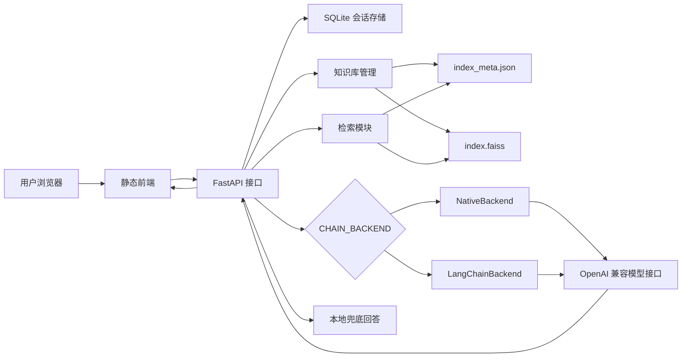
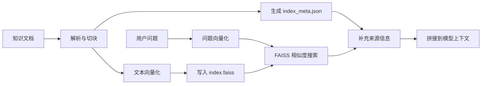

# AlgoGuide Agent

AlgoGuide Agent 是一个面向算法学习场景的本地 AI 问答助手。项目基于 FastAPI、静态前端、本地知识库、向量检索和 OpenAI 兼容模型接口，提供算法问题问答、知识库检索、来源引用、流式输出和会话持久化能力。

项目目标不是构建一个普通聊天页面，而是提供一条完整的 RAG 问答链路：用户提出问题后，系统先检索本地知识库，再结合命中片段生成回答，并将来源和证据片段返回给前端展示。

## 功能特性

- **算法问答**：支持围绕算法概念、题解思路、复杂度分析和代码实现进行提问。
- **RAG 检索增强**：使用 `sentence-transformers` 生成文本向量，并通过 `FAISS` 进行本地相似度检索。
- **来源引用**：回答结果包含命中的文档来源、片段摘要、位置和相关度信息。
- **流式输出**：支持 `/api/chat/stream` 以 Server-Sent Events 形式返回增量回答。
- **会话持久化**：聊天记录保存到 SQLite，支持最近会话、会话详情、重命名和删除。
- **长对话摘要**：长会话会生成摘要，并结合最近消息继续参与后续问答。
- **知识库管理**：支持知识库列表、文档详情、文档更新、删除和重新构建索引。
- **文档导入**：支持 `PDF`、`DOCX`、`PPTX`、`Markdown`、`TXT` 和 `LaTeX` 文件上传。
- **OCR 兜底**：低质量 PDF 会尝试 OCR 解析，并返回可读的错误提示。
- **本地兜底回答**：模型接口不可用或请求失败时，系统会返回本地兜底结果，保证基础可用性。
- **双生成后端**：可通过 `CHAIN_BACKEND` 在原生请求与 LangChain LCEL 生成链之间切换。

## 技术栈

- 后端：`FastAPI`、`Pydantic`、`Uvicorn`
- 生成编排：原生 `urllib` 或 `LangChain LCEL`
- 前端：原生 `HTML`、`CSS`、`JavaScript`
- 存储：`SQLite`、本地 JSON 元数据
- 检索：`sentence-transformers`、`FAISS`
- 文档解析：`pypdf`、`PyMuPDF`、`python-docx`、`python-pptx`
- OCR：`pytesseract`、`Pillow`
- 测试：`unittest`、`FastAPI` 相关接口与核心模块测试

## 系统架构


```mermaid
flowchart LR
  U[用户浏览器] --> F[静态前端]
  F --> A[FastAPI 接口]
  A --> S[SQLite 会话存储]
  A --> K[知识库管理]
  K --> M[index_meta.json]
  K --> V[index.faiss]
  A --> R[检索模块]
  R --> M
  R --> V
  A --> C{CHAIN_BACKEND}
  C --> N[NativeBackend]
  C --> L[LangChainBackend]
  N --> O[OpenAI 兼容模型接口]
  L --> O
  O --> A
  A --> B[本地兜底回答]
  A --> F
```

## 目录结构

```text
.
├── app.py                         # FastAPI 入口和接口定义
├── agent/
│   ├── chain.py                   # 对话编排、模型调用、流式输出
│   ├── langchain_retriever.py     # 现有检索结果到 LangChain Document 的适配
│   ├── retriever.py               # 本地知识库检索
│   ├── sessions.py                # SQLite 会话存储
│   ├── prompt.py                  # 系统提示词
│   ├── env.py                     # .env 加载
│   ├── telemetry.py               # 本地事件日志
│   └── backends/
│       ├── base.py                # 统一生成输入、输出和后端协议
│       ├── native.py              # urllib 原生生成后端
│       ├── langchain.py           # LangChain LCEL 生成后端
│       └── factory.py             # 根据 CHAIN_BACKEND 选择后端
├── knowledge/
│   ├── build_index.py             # 索引构建入口
│   ├── embeddings.py              # embedding 模型封装
│   ├── library.py                 # 知识库和文档管理
│   ├── docs/                      # 内置知识文档
│   ├── index_meta.json            # 检索元数据
│   └── index.faiss                # FAISS 向量索引
├── static/
│   ├── index.html                 # 前端页面
│   ├── script.js                  # 前端交互逻辑
│   └── style.css                  # 前端样式
├── tests/
│   ├── test_core.py               # 核心测试
│   └── test_backends.py           # 双后端及流式协议测试
├── requirements.txt               # 基础依赖
├── requirements.langchain.txt     # LangChain 后端依赖
├── requirements.semantic.txt      # 语义检索依赖
└── scripts/
    └── start.ps1                  # Windows 启动脚本
```

## 核心流程

### 问答流程

1. 用户在前端提交算法问题。
2. 后端读取当前会话、历史消息和会话摘要。
3. 检索模块从本地知识库中召回相关片段。
4. 系统根据检索分数判断是否启用 RAG。
5. 如果模型接口可用，根据 `CHAIN_BACKEND` 选择 Native 或 LangChain 后端。
6. 选中的后端使用同一份问题、历史消息和检索上下文调用 OpenAI 兼容接口。
7. 如果模型接口不可用，后端返回本地兜底回答。
8. 回答、来源、证据片段和会话状态返回前端。
9. 本轮对话写入 SQLite。

### 生成后端切换

Native 后端是默认稳定基线，直接使用 `urllib` 调用 OpenAI 兼容接口：

```env
CHAIN_BACKEND=native
```

LangChain 后端使用 `ChatPromptTemplate | ChatOpenAI | StrOutputParser` 组成 LCEL
生成链，并通过同一套 SSE 协议返回流式结果：

```env
CHAIN_BACKEND=langchain
```

两种后端共用检索、置信度门控、来源、证据、会话和遥测逻辑。正常请求只会调用
当前选中的一个后端，不会产生双倍模型请求。

### 向量检索流程


```mermaid
flowchart LR
  A[知识文档] --> B[解析与切块]
  B --> C[生成 index_meta.json]
  B --> D[文本向量化]
  D --> E[写入 index.faiss]
  F[用户问题] --> G[问题向量化]
  G --> H[FAISS 相似度搜索]
  E --> H
  C --> I[补充来源信息]
  H --> I
  I --> J[拼接到模型上下文]
```

## 快速开始

### 1. 创建虚拟环境

```powershell
python -m venv .venv
```

### 2. 激活虚拟环境

```powershell
.\.venv\Scripts\Activate.ps1
```

如果 PowerShell 阻止脚本执行，可以先运行：

```powershell
Set-ExecutionPolicy -ExecutionPolicy RemoteSigned -Scope CurrentUser
```

### 3. 安装依赖

```powershell
pip install -r requirements.txt
```

如果需要启用完整语义检索能力，继续安装：

```powershell
pip install -r requirements.semantic.txt
```

如果需要启用 LangChain 后端，继续安装：

```powershell
pip install -r requirements.langchain.txt
```

### 4. 配置环境变量

复制 `.env.example` 为 `.env`，并按需填写模型配置：

```env
OPENAI_API_KEY=your_api_key
OPENAI_MODEL=gpt-4.1-mini
OPENAI_BASE_URL=https://api.openai.com/v1
OPENAI_TIMEOUT_SECONDS=60
CHAIN_BACKEND=native
UPLOAD_MAX_BYTES=52428800
```

也可以使用其他 OpenAI 兼容接口，例如：

```env
OPENAI_API_KEY=your_glm_api_key
OPENAI_MODEL=glm-5.1
OPENAI_BASE_URL=https://open.bigmodel.cn/api/paas/v4/
OPENAI_TIMEOUT_SECONDS=60
```

### 5. 构建知识库索引

```powershell
python knowledge\build_index.py
```

成功后会生成或更新：

- `knowledge/index_meta.json`
- `knowledge/index.faiss`

如果首次下载 embedding 模型较慢，可以临时指定 Hugging Face 镜像：

```powershell
$env:HF_ENDPOINT='https://hf-mirror.com'
$env:EMBEDDING_ALLOW_DOWNLOAD='1'
python knowledge\build_index.py
```

如果本机存在异常代理配置，可以在当前 PowerShell 会话中临时关闭代理：

```powershell
$env:HTTP_PROXY=''
$env:HTTPS_PROXY=''
$env:ALL_PROXY=''
$env:http_proxy=''
$env:https_proxy=''
$env:all_proxy=''
$env:NO_PROXY='*'
$env:no_proxy='*'
```

### 6. 启动服务

```powershell
uvicorn app:app --reload
```

或者使用启动脚本：

```powershell
.\scripts\start.ps1
```

启动后访问：

```text
http://127.0.0.1:8000
```

## 启动脚本参数

`scripts/start.ps1` 支持以下参数：

- `-Port 8010`：指定启动端口。
- `-SkipInstall`：跳过依赖安装。
- `-SkipIndex`：跳过索引构建。
- `-InstallSemanticDeps`：额外安装语义检索依赖。

示例：

```powershell
.\scripts\start.ps1 -Port 8010 -InstallSemanticDeps
```

## API 接口

### 基础接口

- `GET /api/health`：健康检查。
- `GET /api/status`：模型接口配置状态。

### 聊天接口

- `POST /api/chat`：普通问答。
- `POST /api/chat/stream`：流式问答。

聊天接口主要返回字段：

- `answer`：回答正文。
- `sources`：来源文件列表。
- `evidence`：命中的证据片段。
- `used_rag`：是否使用本地知识库。
- `rag_confidence`：检索置信度。
- `retrieval_mode`：检索模式，语义索引可用时为 `hybrid`（语义 + 词面混合排序）。
- `low_confidence_reason`：低置信命中的原因。
- `session_id`：当前会话 ID。
- `session`：会话摘要信息。

### 会话接口

- `GET /api/sessions`：最近会话列表。
- `GET /api/sessions/{session_id}`：会话详情。
- `PUT /api/sessions/{session_id}/title`：更新会话标题。
- `DELETE /api/sessions/{session_id}`：删除会话。

### 知识库接口

- `GET /api/knowledge-bases`：知识库列表。
- `GET /api/knowledge-bases/{knowledge_base_id}/documents`：知识库文档列表。
- `PUT /api/knowledge-bases/{knowledge_base_id}`：重命名知识库。
- `DELETE /api/knowledge-bases/{knowledge_base_id}`：删除知识库。
- `GET /api/knowledge-documents/{document_id}`：文档详情。
- `PUT /api/knowledge-documents/{document_id}`：更新文档。
- `DELETE /api/knowledge-documents/{document_id}`：删除文档。
- `POST /api/knowledge/upload`：上传文档并生成预览。
- `POST /api/knowledge/confirm`：确认上传草稿并入库。
- `POST /api/knowledge/cancel`：取消上传草稿。

## 文档导入说明

支持格式：

- `PDF`
- `DOCX`
- `PPTX`
- `Markdown` (`.md` / `.markdown`)
- `TXT`
- `LaTeX` (`.tex` / `.latex`)

处理说明：

- 扫描版或低质量 PDF 会先尝试普通文本提取，再按情况尝试 OCR。
- OCR 需要系统安装 Tesseract 可执行程序，并正确配置语言包。
- 旧版 `.ppt` 暂不直接解析，建议另存为 `.pptx` 后上传。
- 上传大小默认限制为 `50MB`，可通过 `UPLOAD_MAX_BYTES` 调整。

## 环境变量

- `OPENAI_API_KEY`：模型接口密钥。
- `OPENAI_MODEL`：模型名称。
- `OPENAI_BASE_URL`：OpenAI 兼容接口地址。
- `OPENAI_TIMEOUT_SECONDS`：模型请求超时时间。
- `CHAIN_BACKEND`：回答生成后端，可选 `native`（默认）或 `langchain`。
- `EMBEDDING_MODEL_NAME`：本地 embedding 模型名称。
- `EMBEDDING_ALLOW_DOWNLOAD`：是否允许首次运行时下载 embedding 模型。
- `RAG_SEMANTIC_THRESHOLD`：语义或混合检索的接受阈值，默认 `0.30`。
- `UPLOAD_MAX_BYTES`：单文件上传大小限制。
- `OCR_LANG`：OCR 语言配置，默认可使用 `chi_sim+eng`。
- `TESSDATA_PREFIX`：Tesseract 语言包目录。
- `TESSERACT_CMD`：Tesseract 可执行文件路径。

## 测试

运行全部测试：

```powershell
python -m unittest discover -s tests -v
```

当前测试覆盖内容包括：

- SQLite 会话保存和摘要。
- 文档上传解析。
- Markdown、LaTeX、PPTX、PDF 处理。
- OCR 失败时的错误提示。
- 知识库重命名、删除、文档更新和上传草稿。
- 无模型密钥时的本地兜底回答。
- 低置信度检索不强制使用 RAG。
- 上传大小限制。
- Native/LangChain 后端工厂选择。
- 两种后端的统一生成协议和 LangChain 流式文本适配。
- LangChain Retriever 的来源、位置、分数和检索模式元数据。
- SSE 事件顺序 `meta → delta → done`。

## 已知限制

- `sentence-transformers` 模型首次下载依赖网络环境，网络不稳定时建议使用镜像或离线模型。
- 复杂 PDF、扫描件、公式密集文档的解析质量取决于源文件质量和 OCR 环境。
- 当前没有用户登录和多用户隔离，所有数据默认保存在本地。
- 知识库元数据仍包含 JSON 存储，后续可以迁移到统一数据库。
- 前端逻辑集中在单个 `script.js` 中，功能继续扩展后适合拆分模块。

## 后续规划

- 支持按知识库选择检索范围。
- 优化来源引用的定位和高亮展示。
- 增加诊断接口，显示模型、索引、OCR 和存储状态。
- 将知识库元数据逐步迁移到 SQLite。
- 增加更多接口级测试和端到端测试。
- 支持用户隔离、多知识库权限和更完整的部署配置。
